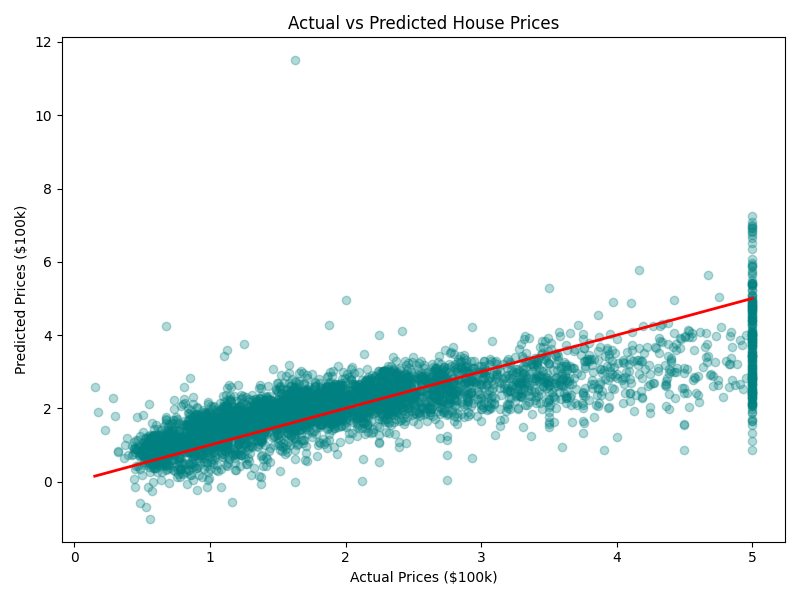

# House-Price-Prediction

### 📌 Intern Information
* **Intern ID:** CITS2704
* **Full Name:** Daksh Tokas
* **No. of Weeks:** 4 Weeks
* **Project Name:** House-Price-Prediction
* **Project Scope:** 
Building a Machine Learning model using Linear Regression to analyze housing features (like average rooms, income, location) and predict median house values.

---

## 🛠️ Project Deliverables

### 1. Source Code
* All model logic is written in cleanly commented Python inside `model.py`.

### 2. Documentation
* **Language:** Python 3.x
* **Libraries Used:** `pandas`, `scikit-learn`, `matplotlib`
* **Algorithm:** Linear Regression

### 3. Output & Screenshots
The model automatically outputs performance metrics to the console and generates a visualization plot.

#### Model Metrics:
* Mean Squared Error (MSE): ~0.55
* R-squared Score: ~0.57

#### Output Visualization:
